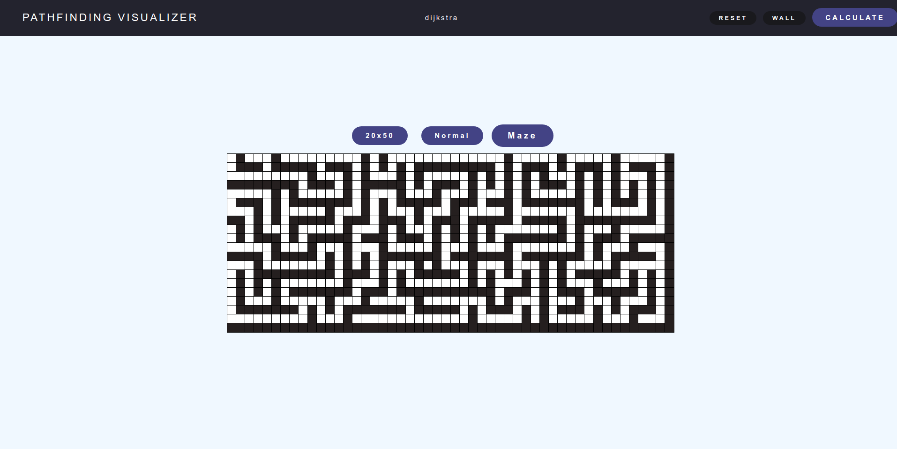

# Shortest Path Visualizer

## Welcome 👋



## Challenge

The challenge revolved around creating a visually interactive pathfinding algorithm tool, with an initial focus on implementing Dijkstra's algorithm. Dijkstra's algorithm, an integral part of this project, is a well-known pathfinding algorithm used to find the shortest path between nodes in a graph. It operates by exploring the graph in a systematic manner, iteratively selecting the node with the smallest distance from the starting node and updating the distances to its neighboring nodes. This ensures the discovery of the shortest path from the starting point to every other node in the graph.

The user interface was meticulously designed using HTML and CSS, while the central grid came to life dynamically through JavaScript.

Additionally, a captivating maze generation feature was brought to life using JavaScript, employing a backtracking algorithm. This approach involved making random attempts to navigate to adjacent squares from the current position. When the chosen square had already been visited, a wall was constructed. This process continued until every cell had been visited, ultimately creating a maze.
## Installation

1. Clone the repository

```bash
git clone https://github.com/gparizotto/Shortest-Path.git
```

2. Enter in the directory

```bash
cd Shortest-Path
```

3. Install the dependencies

```node
npm i
```

4. Run the application

```node
npm start
```

## Application Demo

### Basic Demo
Finding the minimum path between two squares and a wall between them.


### Larger Grid
Finding the minimum path but in a larger grid.


### Implementing Maze
Finding the minimum and only path in a maze between two squares.


### No Solution
Demo when there's no path between the cells.


## Contribute 📫 

Here you will explain how other developers can contribute to your project. For example, explaining how can create their branches, which patterns to follow and how to open an pull request


```bash
git clone https://github.com/gparizotto/Shortest-Path.git
```

```
git checkout -b feature/NAME
```

**Follow commit patterns**

**Open a Pull Request explaining the problem solved or feature made, if exists, append screenshot of visual modifications and wait for the review!**